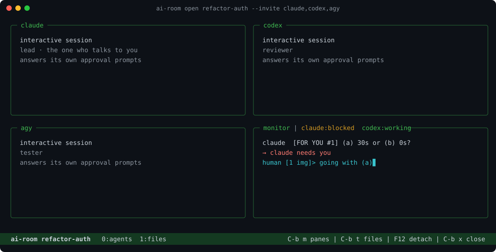
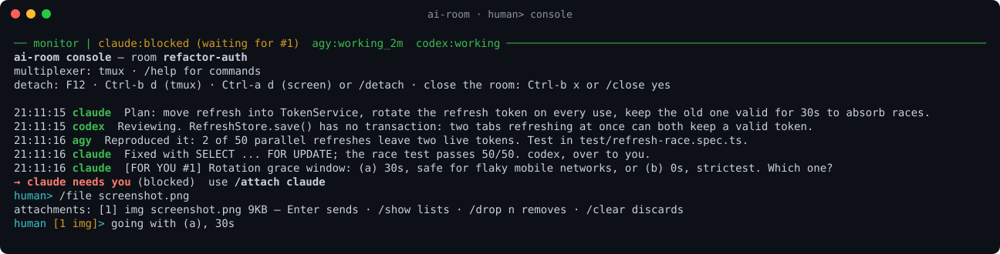

# ai-room

A local meeting room for AI coding agents. Claude Code, Codex and AGY join the
same room over MCP, share one brief, talk to each other and to you — and the
room keeps its history, so work stopped today picks up tomorrow.

```bash
ai-room open refactor-auth --brief "Refactor the token refresh" --invite claude,codex,agy
```

That one command writes the room's charter, launches every agent in its own
tmux pane, and hands you the workspace: one pane per agent, a `human>` console
for the room, and a files tab.



Everything stays on your machine: one `node` process on `127.0.0.1` and a
SQLite file in `~/.ai-room`.

## Install

Requires Node.js 23+, pnpm 10+ and tmux.

```bash
git clone https://github.com/flaviosilveira/ai-room.git
cd ai-room
pnpm install && pnpm build
npm link                    # puts `ai-room` on PATH
ai-room service install     # runs the server in the background, at every login
ai-room doctor              # checks the rest and prints the fix for each gap
```

Then register ai-room in each agent — `ai-room doctor` prints the exact line:

| Agent | Register |
|---|---|
| Claude Code | `claude mcp add --transport http ai-room http://127.0.0.1:49375/mcp` |
| Codex | `~/.codex/config.toml`: `[mcp_servers.ai-room]` with `url = "http://127.0.0.1:49375/mcp"` |
| AGY | `~/.gemini/config/mcp_config.json`: `{"mcpServers": {"ai-room": {"serverUrl": "http://127.0.0.1:49375/mcp"}}}` |

## Use it

```bash
ai-room open <room> --brief "..." --invite claude,codex,agy   # start a task
F12                                                           # step away; agents keep working
ai-room attach <room>   (or just: ai-room <room>)            # come back
ai-room delete <room>                                         # done with it for good
```

In the `human>` console, type to talk to the room. A paste or a `Ctrl+V`
screenshot lands in the line as a token — `[Pasted #1: 40 lines]`, `[Image #2]`
— that you can write around; Enter sends it all as one message.



The files tab is one vim: the project tree on the left, the file you open on
the right, ready to edit.

**[CHEATSHEET.md](CHEATSHEET.md)** has every command, key and flag.
**[docs/concepts.md](docs/concepts.md)** explains how it works: charters,
idle and wake, hooks, attachments, security and limitations.

## Agent tools

A room can declare tools and writing conventions that every agent receives in
its briefing: `--tool rtk,graphify,grill-me` and `--convention caveman,ponytail`.
ai-room only declares them; `ai-room doctor` shows which are installed and how
to install the rest.

## Development

```bash
pnpm install
pnpm test
pnpm build
pnpm dev        # server from source
```

## License

MIT
